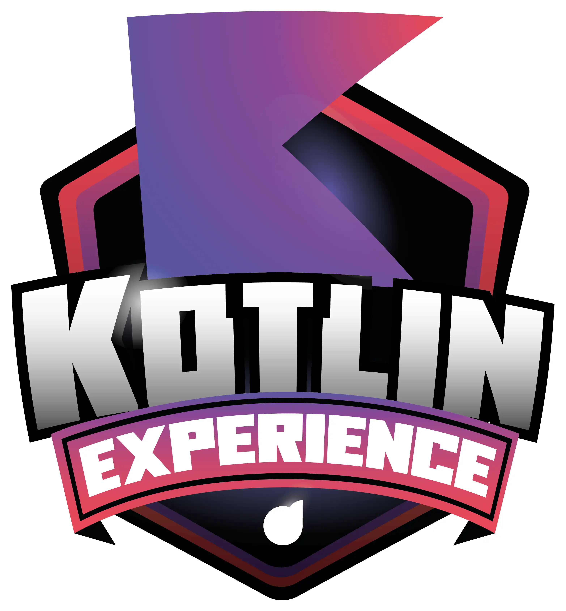

<h1>

Bootcamp Kotlin Experience </h1>

<h3> Andamento do Processo:</h3>

## #1 Princípios de Agilidade e Desenvolvimento de Software

  - [x] Conheça as Oportunidades da DIO

  - [x] Seja Protagonista Neste Bootcamp
  
  - [x] Mentoria (Live) | Kotlin Experience | Aula Inaugural 

  - [x] Introdução ao Desenvolvimento Moderno de Software

  - [x] Como Entregar seu Desafio de Projeto
 
  - [x] Criando seu Primeiro Repositório no GitHub Para Compartilhar Seu Progresso

   

## #2 Dominando a Linguagem de Programação Kotlin

  - [X] Conhecendo o Kotlin e Sua Documentação Oficial

  - [x] Introdução Prática à Linguagem de Programação Kotlin
  
  - [x] Estruturas de Controle de Fluxo e Coleções em Kotlin

  - [x] Orientação a Objetos e Tipos de Classes na Prática com Kotlin

  - [ ] O Poder das Funções em Kotlin
 
  - [ ] Abstraindo Formações da DIO Usando Orientação a Objetos com Kotlin

   

## #3 Refinando Sua Técnica Com Desafios de Código em Kotlin

  - [ ] Suas Primeiras Condições em Kotlin

  - [ ] Avançando Tecnicamente Com a Expressão When
  
  - [ ] Explorando Mapas, Loops e Regras com Kotlin

  - [ ] Utilizando a Keyword Object com Orientação a Objetos (OO)

  - [ ] Orientação a Objetos (OO) Visando Soluções Mais Idiomáticas

     

## #4 Fortalecendo Seu Perfil Profissional

  - [x] Deixando Seu LinkedIn Atrativo

  - [x] Turbine Seu Currículo na DIO
  
  - [x] Transformando seu Conhecimento em Artigos Técnicos

  - [x] Se Preparando Para Uma Entrevista

     

  

### _#BootcampKotlinExperience_

### _#ContratoDeCompromisso_

   

